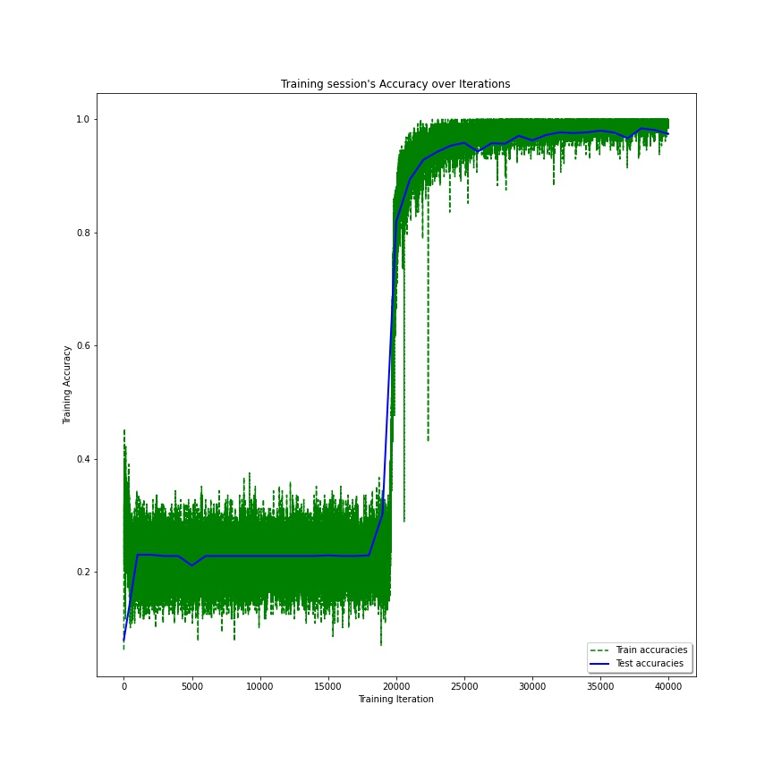
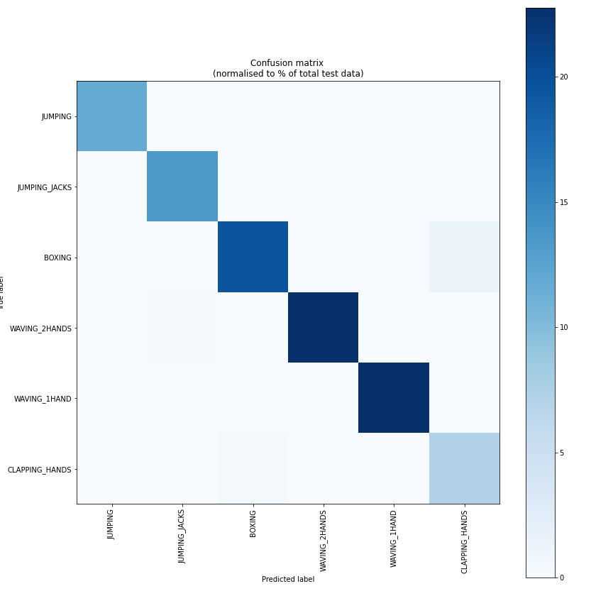
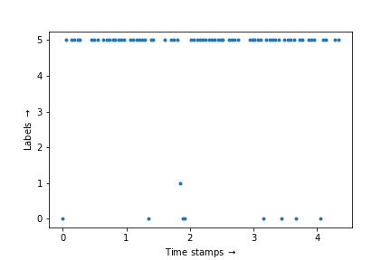

# Human-Activity-Recognition
## RNN-LSTM based Human Activity Recognition 

Running the code is straightforward. Only the `data_paths` must be changed according to where the files are located. 
### How to train?
- Main the code is present in the file `RNN_Human_Activity_Recognition.ipynb`.
- First download the data text files from the following google drive [link](https://drive.google.com/open?id=192z92yZSQwaWbhjAHMumah09bmry6saH). Please download all the files present under the folder `MHAD`.
- Paste above files in convient location of your choice. Then change the following variables present in `RNN_Human_Activity_Recognition.ipynb`.
  - Change `data_path = '/content/gdrive/My Drive/Deep Learning/MHAD/'` to where the text files are saved. And run the code to train. 
  - `X_train.txt`, `X_test.txt`, `Y_train.txt`, and `Y_test.txt` are training and testing files. `datapoint_1.txt`, `datapoint_2.txt`, `datapoint_3.txt`, `datapoint_4.txt`, and `datapoint_5.txt` are the video files on which prediction was shown. 
  - Labels in the data set: jumping, jumping jacks, boxing, waving one hand, waving two hands, and clapping hands.
### How to generate data from a sample video?
- In this repo under the folder `misc` I have uploaded many helper codes. For currently the data provided [here](https://tele-immersion.citris-uc.org/berkeley_mhad) are `.pgm` files for each frame. To get a video out of these frames first run the `ConvertPGMtoPNG.ipynb` (do necessary changes in the file) on all `.pgm` files to get `.png` files. Then run following command in terminal to convert all the `.png` files to a video `ffmpeg -i %0d.png -vcodec libx264 --pix_fmt yuv420p test.mp4`
- If you have video then first run Openpose on it and save all the body landmarks in `.json` files. 
### How to do prediction on a sample video?
### Results
#### Accuracy Test set: 97%

#### Confusion Matrix: possible confusion between labels clapping hands and waving hands, boxing

#### Test video predictions [link](https://youtu.be/G_8_L7a7mLI)

